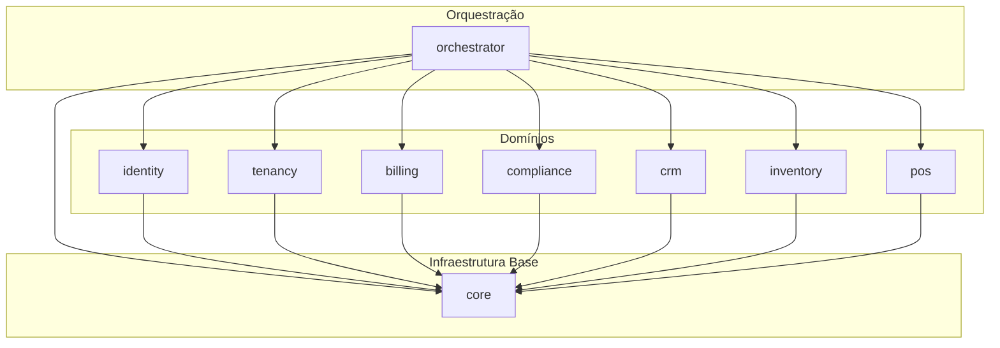
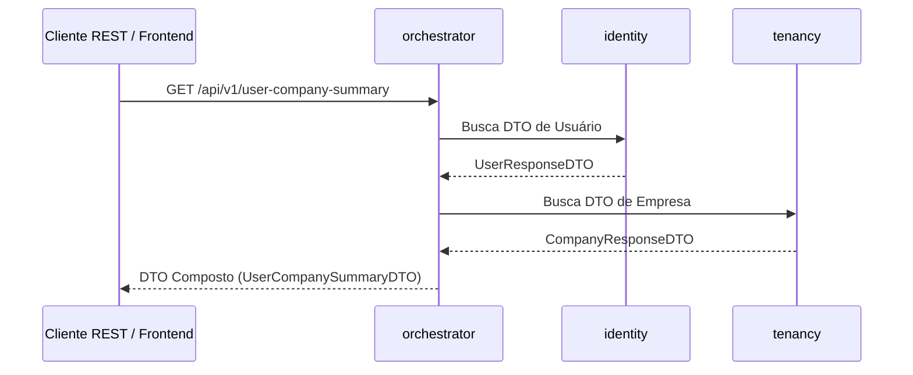
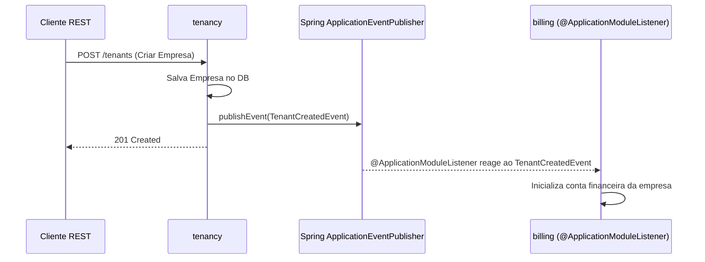

# Arquitetura do Sistema (cs_api)

Este documento descreve as diretrizes, a estrutura de pacotes e os padrões arquiteturais adotados na API **cs_api**.

---

## 1. Visão Geral

O projeto é estruturado utilizando **Spring Modulith**, uma abordagem de monolito modular que garante o isolamento e desacoplamento entre os diferentes domínios da aplicação, permitindo alta manutenibilidade, evolução independente e facilidade de testes.

### Princípios Fundamentais

1. **Isolamento de Domínios**: Nenhum módulo de domínio conhece ou possui dependência direta de outro módulo de domínio.
2. **Comunicação por Eventos**: Ações e efeitos colaterais entre módulos que envolvem mutação de dados são realizados de forma desacoplada através de eventos de aplicação e listeners (`@ApplicationModuleListener`).
3. **Orquestração Apenas na Leitura (REST)**: O módulo `orchestrator` é o maestro da aplicação responsável pela junção de DTOs e agregação de dados para a camada REST. Ele **não** possui acesso direto ao banco de dados (sem entidades JPA ou repositories vinculados a tabelas de negócio).
4. **Core Transversal**: O módulo `core` é a base da aplicação, contendo exceções globais, utilitários comuns e filtros de segurança.

---

## 2. Estrutura de Pacotes

A estrutura principal dos pacotes dentro de `com.dev.cs_api` é organizada da seguinte forma:

```text
com.dev.cs_api
 ├── core         (Sem dependências internas. Contém SecurityUtils, Exceptions base, Filters)
 ├── identity     (Depende apenas do Core. Domínio de usuários, autenticação e autorização)
 ├── tenancy      (Depende apenas do Core. Domínio de empresas, organizações e locatários)
 ├── billing      (Depende apenas do Core. Domínio financeiro e faturamento)
 ├── compliance   (Depende apenas do Core. Domínio fiscal e conformidade)
 ├── crm          (Depende apenas do Core. Domínio de relacionamento com clientes)
 ├── inventory    (Depende apenas do Core. Domínio de estoque e produtos)
 ├── pos          (Depende apenas do Core. Domínio de ponto de venda)
 └── orchestrator (Depende de TODOS os módulos. Maestro para composição de REST e leituras)
```

---

## 3. Matriz de Dependências

O diagrama abaixo ilustra o fluxo permitido de dependências entre os módulos:



> [!IMPORTANT]
> **Regra de Ouro**: Módulos de domínio (`identity`, `tenancy`, `billing`, etc.) **nunca** devem importar classes de outros módulos de domínio.

---

## 4. Padrões de Comunicação

### 4.1. Leitura e Composição REST (`orchestrator`)
- **Propósito**: Agregar dados de múltiplos domínios para responder a requisições HTTP complexas.
- **Funcionamento**: Invoca serviços de leitura expostos pelos módulos necessários e realiza a junção de DTOs de resposta.
- **Restrição**: O `orchestrator` não possui entidades JPA, tabelas de banco de dados próprias ou repositories de escrita/leitura direta no banco.



### 4.2. Escrita, Mutações e Ações Inter-Módulos (`@ApplicationModuleListener`)
- **Propósito**: Notificar outros domínios sobre eventos que ocorreram na aplicação sem gerar acoplamento rígido.
- **Funcionamento**: Um módulo publica um evento de domínio (ex: `TenantCreatedEvent`), e os módulos interessados reagem ao evento utilizando a anotação `@ApplicationModuleListener` do Spring Modulith.



---

## 5. Detalhamento dos Módulos

Esta seção será preenchida e atualizada conforme a implementação dos módulos for sendo finalizada.

| Módulo | Responsabilidade Principal | Status |
| :--- | :--- | :--- |
| `core` | Exceções globais (`BaseExceptionHandler`), utilitários (`SecurityUtils`), filtros de segurança e utilitários transversais. | Em Desenvolvimento |
| `identity` | Gestão de usuários, autenticação (OAuth2/JWT, MFA), permissões e perfis de acesso. | Em Desenvolvimento |
| `tenancy` | Gestão de empresas, filiais, contextos de locatários (*multi-tenancy*) e configurações globais do cliente. | Em Desenvolvimento |
| `billing` | Gestão financeira, faturamento, planos, faturas e métodos de pagamento. | Em Desenvolvimento |
| `compliance` | Regras fiscais, emissão de documentos fiscais e conformidade regulatória. | Em Planejamento |
| `crm` | Gestão de clientes, contatos e histórico de interações. | Em Planejamento |
| `inventory` | Gestão de catálogo de produtos, controle de estoque e movimentações. | Em Planejamento |
| `pos` | Ponto de venda (*Point of Sale*), abertura/fechamento de caixa e vendas diretas. | Em Planejamento |
| `orchestrator` | Orquestração da camada REST para consultas compostas entre domínios. | Em Planejamento |

---

## 6. Validação da Arquitetura

Como o projeto utiliza **Spring Modulith**, a integridade arquitetural e a ausência de acoplamento indevido entre módulos podem ser validadas automaticamente através de testes de unidade com o `ApplicationModules` do Spring Modulith.
